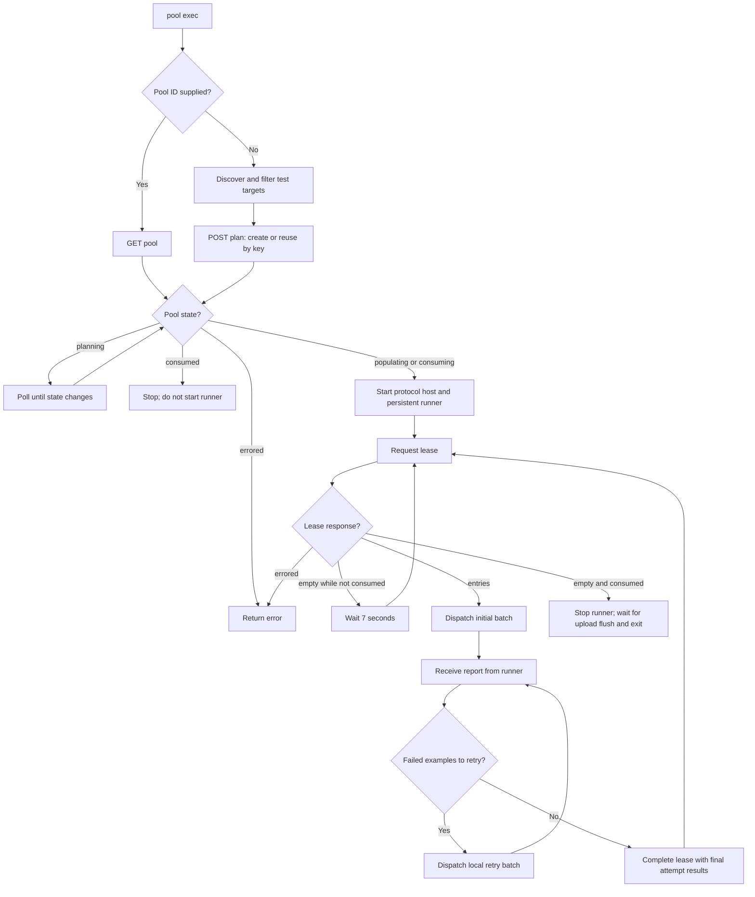
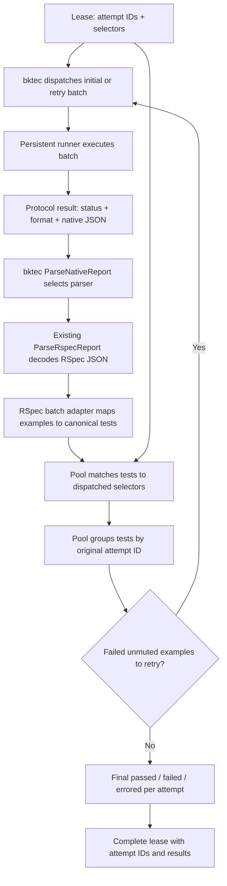

# Persistent pool execution

`bktec pool exec` resolves a shared Scheduler pool and runs its leases in one
persistent runner process. It does not change `bktec run`.

Example using the currently supported RSpec runner:

```shell
bktec pool exec \
  --suite-slug my-suite --test-runner rspec --local-retry-count 2 \
  -- bundle exec buildkite-rspec
```

The arguments after `--` go directly to the persistent runner, not a shell or
ordinary one-shot test command. Runner stdout and stderr flow through bktec.

## Flow



With no pool ID, planning uses the build, pipeline, suite, and shared pool key
(default: `BUILDKITE_STEP_ID`); a separate `pool plan` call is optional. A
supplied `--pool-id` / `BUILDKITE_TEST_ENGINE_POOL_ID` skips discovery and
planning. Leasing starts in `populating` or `consuming`, without waiting for all
entries to be inserted. An already-consumed pool does not start the runner.

## Lease timing

| Event | Timing |
| --- | --- |
| Acquire lease | Up to 249 ms of jitter **before each request**, spreading workers' acquisitions and batch finishes; completion is not delayed. |
| Ownership TTL | 600 seconds on acquire and heartbeat; fixed, not a planning flag. |
| Heartbeat | About every 60 seconds while holding a lease, including retries and final accounting; sooner if less than 180 seconds remain on the current lease. |
| Empty lease | Wait 7 seconds, then apply acquisition jitter and retry while the pool is not consumed. One idle worker stays below 10 empty requests/minute. |
| HTTP 429 | Wait for the Scheduler's reset time. Empty-lease quota is shared by workers with the same job ID. |

For newly planned pools, `--pool-lease-duration-ms` (duration budget) and
`--pool-lease-max-attempts` (attempt limit) each default to `0`: the override is
omitted and the Scheduler chooses the value. These planning settings do not
change the 600-second ownership TTL; a supplied pool ID retains its settings.

One worker holds one lease at a time; there is no prefetch. Only undispatched
work is released. Acquisitions do not retry ambiguous read failures; completions
can retry the same results. Lost ownership stops dispatch rather than claiming
success.

## Authentication and token refresh

Pool requests require a suite-audience OIDC JWT with
`organization_id,pipeline_id,build_id,job_id` claims and `write_test_pool`.
Supply one via `--access-token` / `BUILDKITE_TEST_ENGINE_API_ACCESS_TOKEN`, or
let bktec mint one using the existing OIDC settings (`--oidc`,
`--oidc-lifetime`, and `--buildkite-agent-command`; lifetime defaults to 2 hours).
The Scheduler verifies the token's signature and claims.

- A supplied JWT with a valid `exp` is used first. With OIDC enabled, bktec
  tries to mint a replacement on the first request after half its remaining
  lifetime. If renewal fails, it reuses the supplied token until expiry, then
  fails the request. An already-expired token triggers minting immediately.
  If `exp` is unreadable, bktec uses it once, then tries to mint on the next
  request; the Scheduler decides whether that token is valid.
- Without a supplied token, bktec mints one initially. For that token it uses
  half the remaining `exp` lifetime; for subsequent minted tokens it uses half
  the requested lifetime (or sooner if `exp` is earlier). Refresh happens on
  the **next request**, not on a background timer; an expired token is not
  reused if minting fails.
- With `--no-oidc`, supply a JWT: bktec cannot renew it and rejects a token
  with a known expired `exp`. A token with unreadable expiry may instead be
  rejected by the Scheduler when it expires.

## Runner

- The runner uses the [Unix-socket protocol](../internal/runnerexec/README.md)
  to send batch reports; Windows process supervision is unsupported. The
  current RSpec adapter produces `rspec-json`. Native bktec uploads are not
  invoked; configure uploads in the runner (test-collector-ruby for RSpec).

Runner timeouts: `--runner-startup-timeout=5m`, `--runner-batch-timeout=10m`
(includes report submission), and `--runner-shutdown-timeout=1m30s` (includes
collector flush). Measure these against your application before rollout.

## Result parsing and consolidation



`completed` means the runner supplied a report, not that its tests passed.
The parser normalizes runner-specific identities; pool execution groups the
reported tests by their original lease attempt, including results from retry
batches, then completes the lease with passed, failed, or errored attempts.

Each reported test must match exactly one dispatched batch item: a file or
selector by its primary selector, or an example by ID or file:line. Multiple
examples can belong to one attempt; disjoint file and example selectors can
share a lease. An overlapping file selector and example from that file are
ambiguous and mark the batch's attempts errored rather than guessing.

- `--local-retry-count` (env: `BUILDKITE_TEST_SCHEDULER_LOCAL_RETRY_COUNT`,
  default `0`) adds example retry batches without creating new Scheduler
  attempts or changing the server's default one-attempt policy. Muted failures
  do not retry; pending examples pass. Retry selectors use example IDs or
  file/line paths. File-load errors are not retried and remain errors even if
  example retries pass; missing or unmappable reports also error.
- `bktec --debug pool exec ...` shows retry rounds, provisional batch counts,
  and final passed/failed/errored counts per completed lease. Failed attempts
  without other errors exit 1; unresolved reports with a clean runner exit
  exit 16; a runner process error retains its exit code when available.

TE-7031 terminal accounting review and TE-7034 integration validation are
still required before dogfood rollout.
